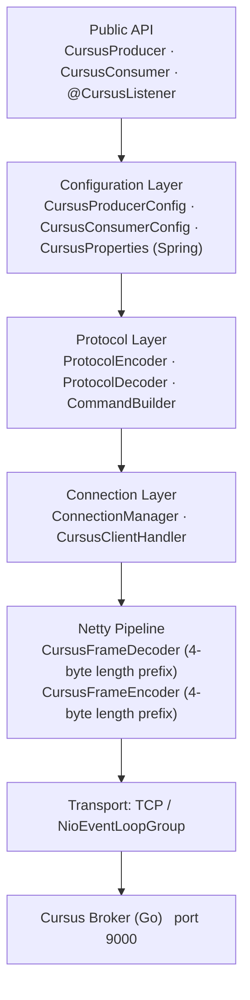
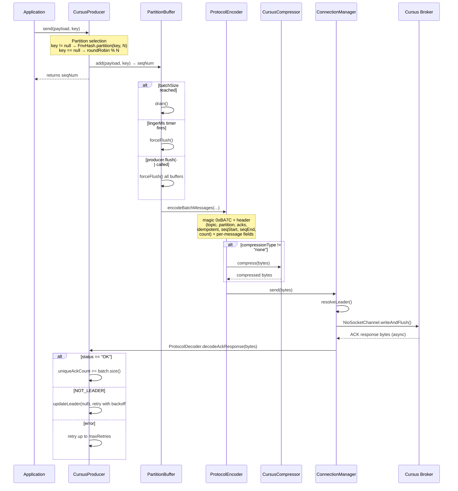
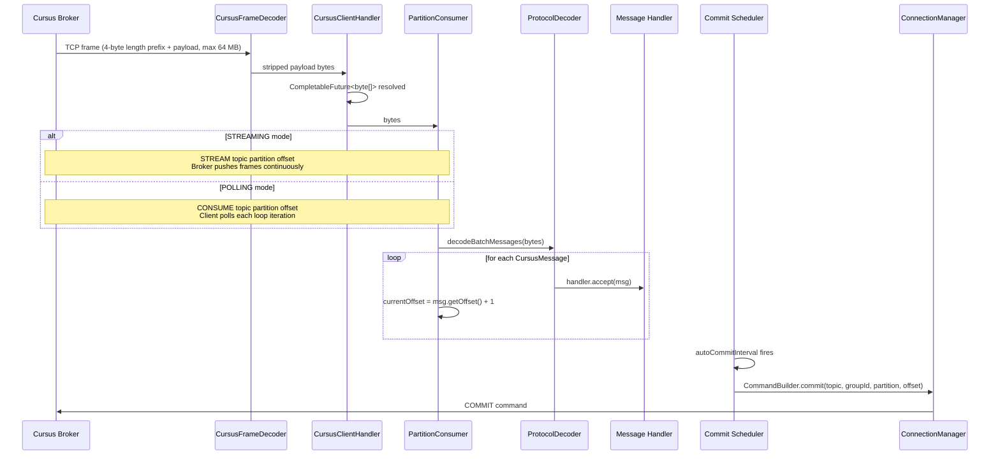

# Architecture

## Module Structure

```
cursus-java (root Gradle project)
│
├── cursus-client                    Core library — no Spring dependency
│   ├── compression/                 CursusCompressor, GzipCompressor, CompressionRegistry
│   ├── config/                      CursusProducerConfig, CursusConsumerConfig, Acks, ConsumerMode
│   ├── connection/                  ConnectionManager, CursusFrameDecoder, CursusFrameEncoder,
│   │                                CursusClientHandler
│   ├── consumer/                    CursusConsumer, PartitionConsumer
│   ├── exception/                   CursusException, CursusConnectionException,
│   │                                CursusProducerClosedException, CursusNotLeaderException
│   ├── message/                     CursusMessage, AckResponse
│   ├── producer/                    CursusProducer, PartitionBuffer, BatchState
│   ├── protocol/                    ProtocolEncoder, ProtocolDecoder, CommandBuilder
│   └── util/                        ExecutorFactory, RuntimeDetector, FnvHash, Backoff
│
├── cursus-spring-boot-starter       Spring Boot auto-configuration layer
│   ├── annotation/                  @CursusListener, CursusListenerRegistrar (BeanPostProcessor)
│   └── autoconfigure/               CursusAutoConfiguration (@ConditionalOn…), CursusProperties
│
└── cursus-examples
    ├── standalone/                  5 standalone runnable examples
    └── spring-boot/                 Spring Boot REST app (ProducerController, EventListener)
```

## Layer Diagram



## Producer Data Flow



## Consumer Data Flow



## Go SDK Mapping

The Java client mirrors the Go SDK's public surface. Key equivalences:

| Go SDK (config.go / types.go)        | Java SDK                                     |
|--------------------------------------|----------------------------------------------|
| `PublisherConfig`                    | `CursusProducerConfig`                       |
| `ConsumerConfig`                     | `CursusConsumerConfig`                       |
| `Message` struct                     | `CursusMessage`                              |
| `AckResponse` struct                 | `AckResponse`                                |
| `EncodeMessage` / `EncodeBatch`      | `ProtocolEncoder.encodeBatchMessages()`      |
| `DecodeBatchMessages`                | `ProtocolDecoder.decodeBatchMessages()`      |
| `hash/fnv` for partition routing     | `FnvHash.partition()`                        |
| `CREATE`, `CONSUME`, `STREAM`, etc.  | `CommandBuilder.create()`, `.consume()`, etc.|
| `BATCH_MAGIC = 0xBA7C`               | `ProtocolEncoder.BATCH_MAGIC`                |
| `Acks.ONE`, `ALL`, `NONE`            | `Acks.ONE`, `Acks.ALL`, `Acks.NONE`          |
| Polling / Streaming consumer mode    | `ConsumerMode.POLLING` / `STREAMING`         |
