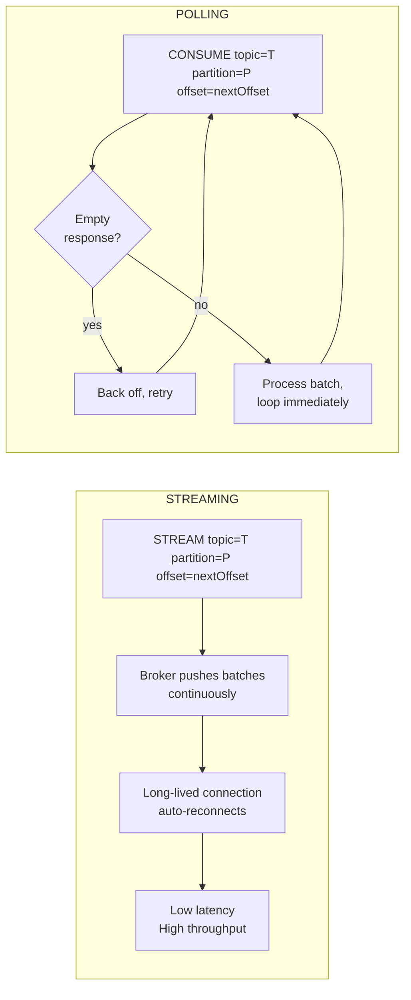
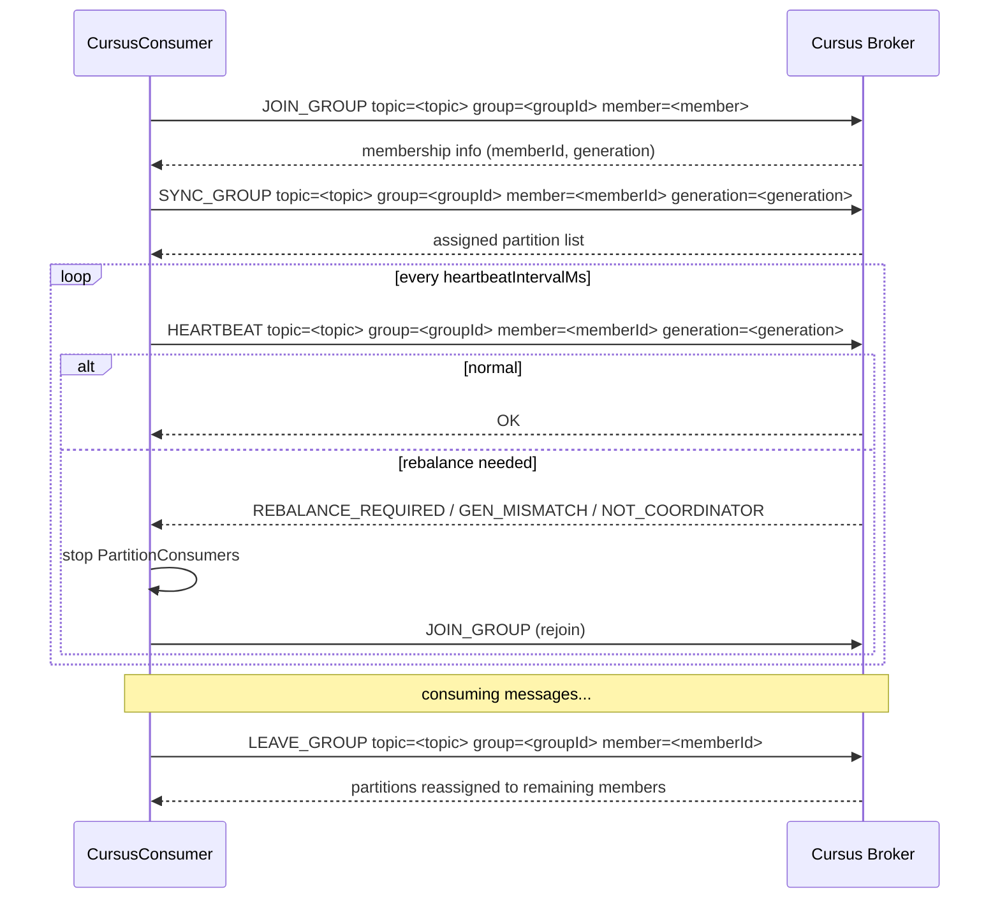
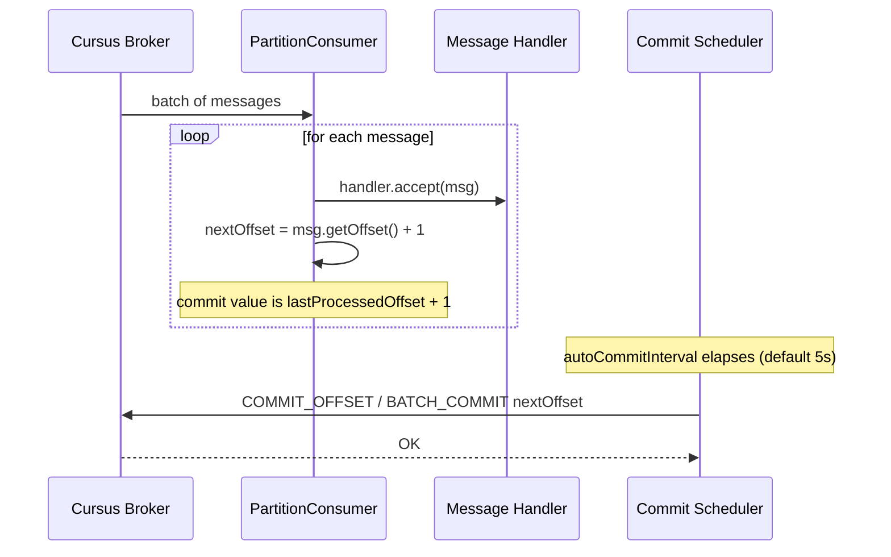

# Consumer Guide

`CursusConsumer` subscribes to a topic partition set assigned by the broker, delivers messages to your handler callback, and manages offsets and heartbeats automatically.

## Basic Usage

Build a `CursusConsumerConfig`, construct the consumer, and call `start()` with a message handler. `start()` blocks the calling thread and runs until `close()` is called (typically from a shutdown hook or another thread).

```java
import io.cursus.client.config.AutoOffsetReset;
import io.cursus.client.config.ConsumerMode;
import io.cursus.client.config.CursusConsumerConfig;
import io.cursus.client.consumer.CursusConsumer;
import io.cursus.client.message.CursusMessage;
import java.util.List;

CursusConsumerConfig config = CursusConsumerConfig.builder()
        .brokers(List.of("localhost:9000"))
        .topic("orders")
        .groupId("order-processors")
        .consumerMode(ConsumerMode.STREAMING)
        .autoOffsetReset(AutoOffsetReset.EARLIEST)
        .build();

CursusConsumer consumer = new CursusConsumer(config);
Runtime.getRuntime().addShutdownHook(new Thread(consumer::close));

consumer.start(message -> {
    System.out.printf("offset=%d  key=%s  payload=%s%n",
            message.getOffset(), message.getKey(), message.getPayload());
});
```

The `CursusMessage` object exposes:

| Field | Type | Description |
|---|---|---|
| `payload` | `String` | Message body |
| `key` | `String` | Routing key (may be null) |
| `offset` | `long` | Monotonically increasing position within the partition |
| `seqNum` | `long` | Producer sequence number |
| `producerId` | `String` | Identifier of the producing instance |
| `eventType` | `String` | Optional application-defined event type |
| `metadata` | `String` | Optional application-defined metadata string |
| `schemaVersion` | `long` | Schema version tag |
| `aggregateVersion` | `long` | Aggregate version for event-sourcing patterns |
| `epoch` | `int` | Producer epoch |

## Consumer Modes

Set `consumerMode` to control how the consumer retrieves messages from the broker.

### Streaming (default)

```java
.consumerMode(ConsumerMode.STREAMING)
```

The consumer sends a `STREAM topic=<topic> partition=<P> group=<group> offset=<nextOffset> generation=<G> member=<member>` command and then the broker pushes batches over the same TCP connection as they become available. This is the most efficient mode for applications that need low latency and high throughput. The connection is long-lived; the consumer re-establishes it automatically after transient failures.

### Polling

```java
.consumerMode(ConsumerMode.POLLING)
```

The consumer sends a `CONSUME topic=<topic> partition=<P> offset=<nextOffset> group=<group> generation=<G> member=<member>` command for each poll cycle. After receiving a batch it loops immediately; if the broker returns an empty response it backs off before retrying. Use polling when you want pull-based flow control or when integrating with a framework that has its own polling loop.

### Mode Comparison



## Consumer Groups

Set `groupId` to make the consumer a member of a named group. The broker assigns a subset of the topic's partitions to each group member using modulo-based assignment.

The consumer performs the full group lifecycle automatically:

1. **JOIN_GROUP** — sends `JOIN_GROUP topic=<topic> group=<groupId> member=<member>`. The broker registers the member and returns membership information.
2. **SYNC_GROUP** — sends `SYNC_GROUP topic=<topic> group=<groupId> member=<memberId> generation=<generation>`. The broker returns the list of partition numbers assigned to this member.
3. **Heartbeat** — every `heartbeatIntervalMs` the consumer sends `HEARTBEAT` to keep the session alive. If the broker replies with `REBALANCE_REQUIRED`, `GEN_MISMATCH`, `NOT_OWNER`, `member_not_found`, `group_not_found`, or `NOT_COORDINATOR`, the consumer stops its partition consumers and rejoins or re-resolves the coordinator.
4. **LEAVE_GROUP** — sent automatically when `close()` is called.



Multiple consumers in the same group can be started as separate processes or as separate `CursusConsumer` instances within the same JVM:

```java
// Start two group members in the same JVM (each in its own thread)
CursusConsumerConfig config = CursusConsumerConfig.builder()
        .brokers(List.of("localhost:9000"))
        .topic("events")
        .groupId("event-workers")
        .consumerMode(ConsumerMode.POLLING)
        .maxPollRecords(100)
        .build();

for (int i = 0; i < 2; i++) {
    CursusConsumer member = new CursusConsumer(config);
    new Thread(() -> member.start(msg ->
            System.out.printf("[%s] %s%n", Thread.currentThread().getName(), msg.getPayload())
    )).start();
}
```

## Offset Management

Offsets are tracked per `(topic, groupId, partition)`, and the broker committed offset is the source of truth for resume. After `JOIN_GROUP` / `SYNC_GROUP`, each partition consumer calls `FETCH_OFFSET` and starts `CONSUME` / `STREAM` from that broker-reported next offset. Offsets are committed automatically on a periodic schedule controlled by `autoCommitInterval` (default 5 seconds). Internally the commit scheduler sends `COMMIT_OFFSET` / `BATCH_COMMIT` with `lastProcessedOffset + 1`.



You do not need to call any commit method manually unless you want finer control. If you require lower commit latency, reduce `autoCommitInterval`:

```java
CursusConsumerConfig config = CursusConsumerConfig.builder()
        // ...
        .autoCommitInterval(java.time.Duration.ofSeconds(1))
        .build();
```

Set `autoOffsetReset` to `EARLIEST`, `LATEST`, or `ERROR` to control retention gaps reported by pull `ERROR: OFFSET_OUT_OF_RANGE ...` responses or streaming `STREAM_CONTROL type=CLOSE reason=offset_out_of_range ...` frames. The default is `EARLIEST`. Zero-length stream frames are treated as keepalives.

The `immediateCommit` flag (default `false`) is reserved for future use. When set to `true` the consumer will commit after every individual message rather than batching commits by interval.

### At-least-once delivery

Commits happen after the handler processes records. If the consumer process crashes between receiving a message and the next scheduled commit, those messages will be redelivered. Design your message handler to be idempotent, or use the `offset` field to deduplicate on the consumer side. Committing before processing gives at-most-once behavior and can skip records after a crash. Cursus does not yet provide full external side-effect exactly-once semantics. Lower offset commits are rejected by the broker as `offset_regression`; the SDK treats that as a failed commit and does not rewind local committed state. Coordinator failures such as `GEN_MISMATCH`, `NOT_OWNER`, `member_not_found`, `group_not_found`, and `NOT_COORDINATOR` cause the consumer to fail closed or rejoin according to the current group state.


## Read Isolation

Consumers default to `IsolationLevel.READ_UNCOMMITTED`, which delivers non-transactional records and committed transactional records as soon as the broker exposes them. Set `isolationLevel(IsolationLevel.READ_COMMITTED)` when the consumer must skip aborted records and hold open transaction records until the broker marks them committed.

```java
import io.cursus.client.config.IsolationLevel;

CursusConsumerConfig config = CursusConsumerConfig.builder()
        .brokers(List.of("localhost:9000"))
        .topic("orders")
        .groupId("order-processors")
        .isolationLevel(IsolationLevel.READ_COMMITTED)
        .build();
```

Non-transactional records are delivered under both isolation levels. Transactional processing only covers broker-managed staged records and consumer offsets; external database or API effects must remain idempotent in the application.
## Shutdown

Call `consumer.close()` to shut down gracefully. This:

1. Sends `LEAVE_GROUP` to the broker so partitions are immediately reassigned to remaining group members.
2. Stops all `PartitionConsumer` loops.
3. Shuts down the commit scheduler, heartbeat scheduler, and worker thread pool.
4. Closes the underlying Netty connection.

The method is idempotent; calling it more than once is safe.

```java
// Pattern 1: try-with-resources — only practical when start() is not blocking
try (CursusConsumer consumer = new CursusConsumer(config)) {
    // ...
}

// Pattern 2: shutdown hook — most common for long-running consumers
CursusConsumer consumer = new CursusConsumer(config);
Runtime.getRuntime().addShutdownHook(new Thread(() -> {
    System.out.println("Shutting down...");
    consumer.close();
}));
consumer.start(handler);   // blocks here
```

See [Configuration Reference](configuration-reference.md) for all consumer properties.

External DB offset stores should be treated as legacy fallback or migration aids; broker committed offsets are the default source of truth.
