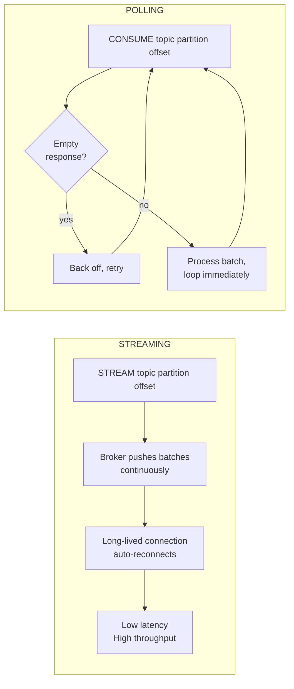
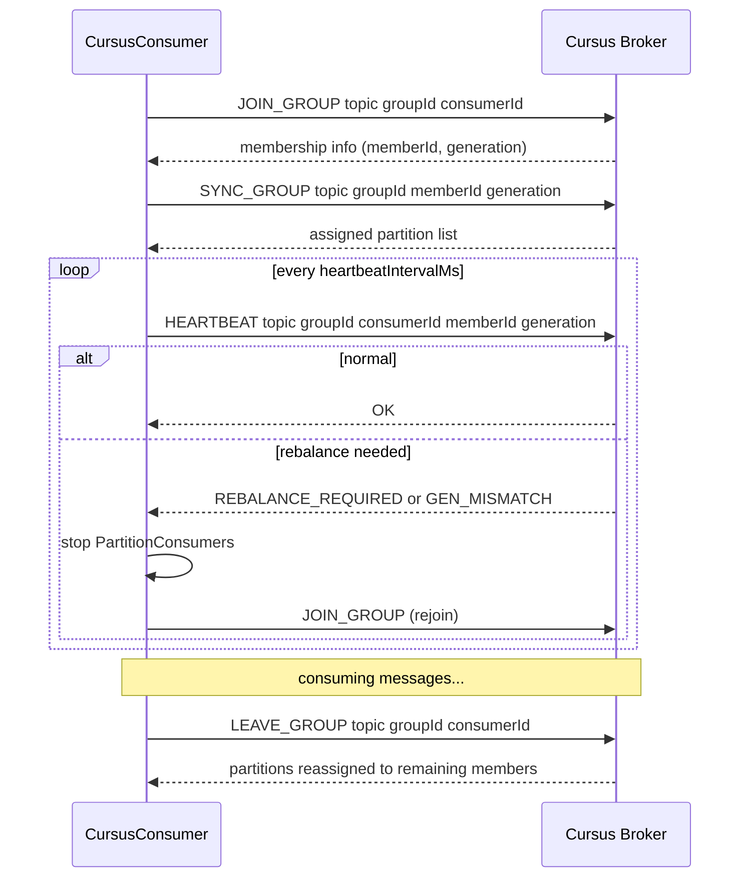
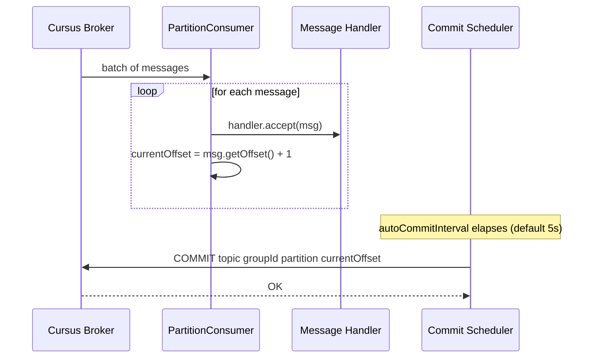

# Consumer Guide

`CursusConsumer` subscribes to a topic partition set assigned by the broker, delivers messages to your handler callback, and manages offsets and heartbeats automatically.

## Basic Usage

Build a `CursusConsumerConfig`, construct the consumer, and call `start()` with a message handler. `start()` blocks the calling thread and runs until `close()` is called (typically from a shutdown hook or another thread).

```java
import io.cursus.client.config.ConsumerMode;
import io.cursus.client.config.CursusConsumerConfig;
import io.cursus.client.consumer.CursusConsumer;
import io.cursus.client.message.CursusMessage;
import java.util.List;

CursusConsumerConfig config = CursusConsumerConfig.builder()
        .brokers(List.of("localhost:9000"))
        .topic("orders")
        .groupId("order-processors")
        .consumerMode(ConsumerMode.STREAMING)
        .build();

CursusConsumer consumer = new CursusConsumer(config);
Runtime.getRuntime().addShutdownHook(new Thread(consumer::close));

consumer.start(message -> {
    System.out.printf("offset=%d  key=%s  payload=%s%n",
            message.getOffset(), message.getKey(), message.getPayload());
});
```

The `CursusMessage` object exposes:

| Field | Type | Description |
|---|---|---|
| `payload` | `String` | Message body |
| `key` | `String` | Routing key (may be null) |
| `offset` | `long` | Monotonically increasing position within the partition |
| `seqNum` | `long` | Producer sequence number |
| `producerId` | `String` | Identifier of the producing instance |
| `eventType` | `String` | Optional application-defined event type |
| `metadata` | `String` | Optional application-defined metadata string |
| `schemaVersion` | `long` | Schema version tag |
| `aggregateVersion` | `long` | Aggregate version for event-sourcing patterns |
| `epoch` | `int` | Producer epoch |

## Consumer Modes

Set `consumerMode` to control how the consumer retrieves messages from the broker.

### Streaming (default)

```java
.consumerMode(ConsumerMode.STREAMING)
```

The consumer sends a `STREAM topic partition offset` command and then the broker pushes batches over the same TCP connection as they become available. This is the most efficient mode for applications that need low latency and high throughput. The connection is long-lived; the consumer re-establishes it automatically after transient failures.

### Polling

```java
.consumerMode(ConsumerMode.POLLING)
```

The consumer sends a `CONSUME topic partition offset` command for each poll cycle. After receiving a batch it loops immediately; if the broker returns an empty response it backs off before retrying. Use polling when you want pull-based flow control or when integrating with a framework that has its own polling loop.

### Mode Comparison



## Consumer Groups

Set `groupId` to make the consumer a member of a named group. The broker assigns a subset of the topic's partitions to each group member using modulo-based assignment.

The consumer performs the full group lifecycle automatically:

1. **JOIN_GROUP** — sends `JOIN_GROUP topic groupId consumerId`. The broker registers the member and returns membership information.
2. **SYNC_GROUP** — sends `SYNC_GROUP topic groupId memberId generation`. The broker returns the list of partition numbers assigned to this member.
3. **Heartbeat** — every `heartbeatIntervalMs` the consumer sends `HEARTBEAT` to keep the session alive. If the broker replies with `REBALANCE_REQUIRED` or `GEN_MISMATCH`, the consumer stops its partition consumers and rejoins the group.
4. **LEAVE_GROUP** — sent automatically when `close()` is called.



Multiple consumers in the same group can be started as separate processes or as separate `CursusConsumer` instances within the same JVM:

```java
// Start two group members in the same JVM (each in its own thread)
CursusConsumerConfig config = CursusConsumerConfig.builder()
        .brokers(List.of("localhost:9000"))
        .topic("events")
        .groupId("event-workers")
        .consumerMode(ConsumerMode.POLLING)
        .maxPollRecords(100)
        .build();

for (int i = 0; i < 2; i++) {
    CursusConsumer member = new CursusConsumer(config);
    new Thread(() -> member.start(msg ->
            System.out.printf("[%s] %s%n", Thread.currentThread().getName(), msg.getPayload())
    )).start();
}
```

## Offset Management

Offsets are committed automatically on a periodic schedule controlled by `autoCommitInterval` (default 5 seconds). Internally the commit scheduler calls `COMMIT topic groupId partition offset` for each active partition consumer.



You do not need to call any commit method manually unless you want finer control. If you require lower commit latency, reduce `autoCommitInterval`:

```java
CursusConsumerConfig config = CursusConsumerConfig.builder()
        // ...
        .autoCommitInterval(java.time.Duration.ofSeconds(1))
        .build();
```

The `immediateCommit` flag (default `false`) is reserved for future use. When set to `true` the consumer will commit after every individual message rather than batching commits by interval.

### At-least-once delivery

Commits happen asynchronously. If the consumer process crashes between receiving a message and the next scheduled commit, those messages will be redelivered. Design your message handler to be idempotent, or use the `offset` field to deduplicate on the consumer side.

## Shutdown

Call `consumer.close()` to shut down gracefully. This:

1. Sends `LEAVE_GROUP` to the broker so partitions are immediately reassigned to remaining group members.
2. Stops all `PartitionConsumer` loops.
3. Shuts down the commit scheduler, heartbeat scheduler, and worker thread pool.
4. Closes the underlying Netty connection.

The method is idempotent; calling it more than once is safe.

```java
// Pattern 1: try-with-resources — only practical when start() is not blocking
try (CursusConsumer consumer = new CursusConsumer(config)) {
    // ...
}

// Pattern 2: shutdown hook — most common for long-running consumers
CursusConsumer consumer = new CursusConsumer(config);
Runtime.getRuntime().addShutdownHook(new Thread(() -> {
    System.out.println("Shutting down...");
    consumer.close();
}));
consumer.start(handler);   // blocks here
```

See [Configuration Reference](configuration-reference.md) for all consumer properties.
