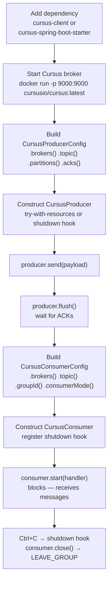

# Getting Started

This guide walks you from zero to sending and receiving your first messages with the Cursus Java Client.

## Prerequisites

- **Java 17 or later** — the library compiles to Java 17 bytecode. Java 21+ is recommended to take advantage of Virtual Thread support.
- **A running Cursus broker** — the broker listens on TCP port `9000` by default.

## Installation

Add the dependency to your Gradle build file. Choose either the standalone core library or the Spring Boot starter.

**Standalone (no Spring)**

```groovy
// build.gradle
repositories {
    mavenCentral()
}

dependencies {
    implementation 'io.github.cursus-io:cursus-client:0.1.0'
}
```

Maven users can add the same artifact:

```xml
<dependency>
  <groupId>io.github.cursus-io</groupId>
  <artifactId>cursus-client</artifactId>
  <version>0.1.0</version>
</dependency>
```

**Spring Boot application**

```groovy
// build.gradle
repositories {
    mavenCentral()
}

dependencies {
    implementation 'io.github.cursus-io:cursus-spring-boot-starter:0.1.0'
    implementation 'org.springframework.boot:spring-boot-starter-web'
}
```

## Start the broker

The quickest way to start a Cursus broker locally is with Docker:

```bash
docker run -d --name cursus -p 9000:9000 cursusio/cursus:latest
```

Verify it is running:

```bash
docker logs cursus
```

You should see a line similar to `Cursus broker listening on :9000`.

## Send your first message

Create a `CursusProducerConfig`, build a `CursusProducer`, and call `send()`. The producer implements `AutoCloseable`, so a try-with-resources block handles clean shutdown automatically.

```java
import io.cursus.client.config.Acks;
import io.cursus.client.config.CursusProducerConfig;
import io.cursus.client.producer.CursusProducer;
import java.util.List;

public class FirstProducer {
    public static void main(String[] args) {
        CursusProducerConfig config = CursusProducerConfig.builder()
                .brokers(List.of("localhost:9000"))
                .topic("hello-topic")
                .partitions(1)
                .acks(Acks.ONE)
                .batchSize(1)    // flush each message immediately for this demo
                .lingerMs(0)
                .build();

        try (CursusProducer producer = new CursusProducer(config)) {
            long seq = producer.send("Hello, Cursus!");
            producer.flush();
            System.out.println("Sent seq=" + seq
                    + "  total acked=" + producer.getUniqueAckCount());
        }
    }
}
```

Run it:

```bash
./gradlew :cursus-examples:standalone:run --main-class io.cursus.examples.standalone.SimpleProducer
```

## Consume messages

Create a `CursusConsumerConfig` with a `groupId`, then call `start()` with a message handler. `start()` blocks the calling thread; run it on a background thread or use your application's threading model.

```java
import io.cursus.client.config.ConsumerMode;
import io.cursus.client.config.CursusConsumerConfig;
import io.cursus.client.consumer.CursusConsumer;
import java.util.List;

public class FirstConsumer {
    public static void main(String[] args) throws Exception {
        CursusConsumerConfig config = CursusConsumerConfig.builder()
                .brokers(List.of("localhost:9000"))
                .topic("hello-topic")
                .groupId("hello-group")
                .consumerMode(ConsumerMode.STREAMING)
                .build();

        CursusConsumer consumer = new CursusConsumer(config);

        // Register shutdown hook so Ctrl+C cleanly leaves the consumer group
        Runtime.getRuntime().addShutdownHook(new Thread(() -> {
            System.out.println("Shutting down consumer...");
            consumer.close();
        }));

        System.out.println("Waiting for messages. Press Ctrl+C to stop.");
        // start() blocks until consumer.close() is called
        consumer.start(msg ->
                System.out.printf("offset=%-6d  payload=%s%n",
                        msg.getOffset(), msg.getPayload()));
    }
}
```

Run it in a second terminal while the producer is running:

```bash
./gradlew :cursus-examples:standalone:run --main-class io.cursus.examples.standalone.SimpleConsumer
```

## Event sourcing

`CursusEventStore` stores append-only streams by aggregate key. `expectedVersion` is the next version you expect to append; the broker rejects stale writes with a version conflict.

```java
import io.cursus.client.eventstore.*;
import java.util.List;

try (CursusEventStore store = new CursusEventStore(
        List.of("localhost:9000"), "orders-es", "orders")) {
    store.createTopic(4);

    store.append(
            "order-1001",
            1,
            Event.builder()
                    .type("OrderCreated")
                    .payload("{\"item\":\"widget\"}")
                    .build());

    StreamData stream = store.readStream("order-1001");
    System.out.println(stream.getEvents().get(0).getType());
}
```

## Cluster brokers

Pass every bootstrap broker address. The client uses those addresses to connect and follows broker redirects when the current connection is not the partition leader.

```java
List<String> brokers = List.of("localhost:9001", "localhost:9002", "localhost:9003");

CursusProducerConfig producerConfig = CursusProducerConfig.builder()
        .brokers(brokers)
        .topic("hello-topic")
        .build();

CursusConsumerConfig consumerConfig = CursusConsumerConfig.builder()
        .brokers(brokers)
        .topic("hello-topic")
        .groupId("hello-group")
        .build();

CursusEventStore events = new CursusEventStore(brokers, "orders-es", "orders");
```

## Quick Start Flow



## Next steps

- [Producer Guide](producer-guide.md) — batching, compression, idempotency, monitoring
- [Consumer Guide](consumer-guide.md) — modes, consumer groups, offset management, shutdown
- [Spring Boot Integration](spring-boot-integration.md) — auto-configuration and `@CursusListener`
- [Configuration Reference](configuration-reference.md) — all properties with types and defaults
- [Examples](../cursus-examples/standalone/README.md) — six ready-to-run standalone examples
