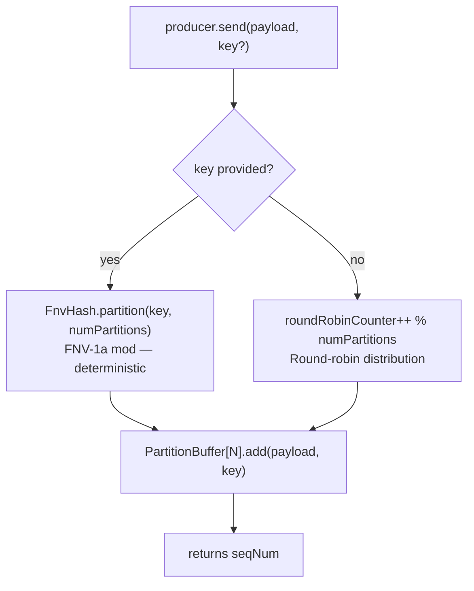

# Producer Guide

`CursusProducer` publishes messages to a Cursus topic. It manages internal per-partition buffers, fires batches asynchronously, and tracks acknowledgments from the broker.

## Basic Usage

Build a `CursusProducerConfig` with the builder, then construct the producer. The producer is `AutoCloseable`; wrap it in try-with-resources or call `close()` explicitly in a shutdown hook.

```java
import io.cursus.client.config.Acks;
import io.cursus.client.config.CursusProducerConfig;
import io.cursus.client.producer.CursusProducer;
import java.util.List;

CursusProducerConfig config = CursusProducerConfig.builder()
        .brokers(List.of("localhost:9000"))
        .topic("orders")
        .partitions(4)
        .acks(Acks.ONE)
        .batchSize(500)
        .lingerMs(100)
        .build();

try (CursusProducer producer = new CursusProducer(config)) {
    long seq = producer.send("order payload");
    producer.flush();
    System.out.println("Total acked: " + producer.getUniqueAckCount());
}
```

`send()` returns the sequence number assigned to the message within its partition buffer. The call is non-blocking: the message is appended to the buffer and the method returns immediately.

## Partition Routing

The producer maintains one `PartitionBuffer` per partition. Each `send()` call selects a target partition before appending the message.

**Round-robin (no key):**

```java
producer.send("payload");   // partition = roundRobinCounter++ % numPartitions
```

**Key-based (deterministic):**

```java
producer.send("payload", "customer-123");
// partition = Math.abs(FNV-1a("customer-123") % numPartitions)
```



The FNV-1a hash is the same algorithm used by the Go SDK (`hash/fnv`), so a given key always maps to the same partition number regardless of which SDK produced the message. Messages with the same key are always routed to the same partition, preserving ordering for that key.

## Batching

Messages accumulate in a per-partition buffer and are flushed as a batch when either threshold is reached:

- **`batchSize`** — the buffer holds this many messages before flushing automatically.
- **`lingerMs`** — a background scheduler fires every `lingerMs` milliseconds and flushes all non-empty buffers.

```mermaid
flowchart TB
    A["Message added to PartitionBuffer"] --> B{batchSize\nreached?}
    B -- yes --> D["PartitionBuffer.drain()\nauto-flush"]
    B -- no --> C{lingerMs\ntimer fires?}
    C -- yes --> E["PartitionBuffer.forceFlush()"]
    C -- no --> F{producer.flush()\ncalled?}
    F -- yes --> G["All buffers forceFlush()"]
    F -- no --> A

    D --> H["ProtocolEncoder.encodeBatchMessages()"]
    E --> H
    G --> H
    H --> I["ConnectionManager.send(bytes)"]
    I --> J["Broker ACK → uniqueAckCount++"]
```

You can also flush all partitions synchronously:

```java
producer.flush();   // blocks up to flushTimeoutMs waiting for all in-flight batches
```

Call `flush()` before shutting down to ensure no messages are lost. `close()` calls `flush()` internally.

Tune batching for your workload:

| Goal | Recommendation |
|---|---|
| Lowest latency (single messages) | `batchSize=1`, `lingerMs=0` |
| Highest throughput | `batchSize=500`, `lingerMs=100` |
| Balanced | `batchSize=100`, `lingerMs=50` |

## Compression

Set `compressionType("gzip")` to compress each batch before sending. Gzip is built in and registered automatically.

```java
CursusProducerConfig config = CursusProducerConfig.builder()
        .brokers(List.of("localhost:9000"))
        .topic("events")
        .partitions(4)
        .batchSize(500)
        .lingerMs(100)
        .compressionType("gzip")
        .build();
```

To register a custom compressor, implement `CursusCompressor` and register it before constructing the producer:

```java
import io.cursus.client.compression.CompressionRegistry;
import io.cursus.client.compression.CursusCompressor;

public class ZstdCompressor implements CursusCompressor {
    @Override
    public String algorithmName() { return "zstd"; }

    @Override
    public byte[] compress(byte[] data) throws Exception {
        // your zstd implementation
        return ZstdOutputStream.compress(data);
    }

    @Override
    public byte[] decompress(byte[] data) throws Exception {
        return ZstdInputStream.decompress(data);
    }
}

// Register once at application startup
CompressionRegistry.getInstance().register(new ZstdCompressor());

// Then use it in config
CursusProducerConfig config = CursusProducerConfig.builder()
        // ...
        .compressionType("zstd")
        .build();
```

The `compressionType` string must exactly match the value returned by `algorithmName()`.

## Idempotent Delivery

When `idempotent(true)` is set, the producer attaches a producer id, producer epoch, and per-partition sequence numbers to each batch. The broker uses these fields to detect duplicate batches and fence stale producer epochs during retries. This provides idempotent producer writes, not full external side-effect exactly-once semantics across producer and consumer processing.

```java
CursusProducerConfig config = CursusProducerConfig.builder()
        .brokers(List.of("localhost:9000"))
        .topic("payments")
        .partitions(4)
        .acks(Acks.ALL)        // idempotent writes work best with ALL acks
        .idempotent(true)
        .build();
```

When idempotent mode is on, sequence numbers start at 1 for a new `(producerId, epoch)` and advance independently per partition. `maxInflightRequests` should be 1 to preserve ordering per partition across retries. The default value of `5` is suitable when idempotent mode is off.


## Transactions

`TransactionalProducer` wraps the broker transaction coordinator commands. A successful commit applies staged output records and staged consumer offsets inside the broker. An abort discards the staged records and offsets. This is a broker-managed record-plus-offset transaction; it does not make external database or API side effects atomic.

```java
import io.cursus.client.transaction.TransactionalProducer;
import java.util.List;
import java.util.Map;

try (TransactionalProducer producer =
        new TransactionalProducer(List.of("localhost:9000"), "orders-worker")) {
    producer.begin();
    producer.publish("processed-orders", -1, "processed payload");
    producer.sendOffsets("orders", "order-workers", "member-1", 7, Map.of(0, 101L));
    producer.commit();
} catch (RuntimeException error) {
    // Recreate the transactional producer after producer fencing or authorization failures.
    throw error;
}
```

`publish(topic, -1, payload)` lets the broker select the target partition. `sendOffsets(...)` sorts partition offsets before building the wire command, so the broker receives `P0:<nextOffset>,P1:<nextOffset>` in stable order. Commit and abort calls are retryable for transient coordinator movement; stale producer epochs are surfaced as terminal producer fencing errors.
## Monitoring

**Total acknowledged message count:**

```java
long acked = producer.getUniqueAckCount();
```

This counter increments by the batch size each time the broker returns an OK ACK. It counts individual messages, not batches.

**Per-partition pending counts:**

```java
import io.cursus.client.producer.CursusProducer.PartitionStat;
import java.util.List;

List<PartitionStat> stats = producer.getPartitionStats();
for (PartitionStat stat : stats) {
    System.out.printf("Partition %d: %d pending messages%n",
            stat.partitionId(), stat.pendingCount());
}
```

`pendingCount()` reflects messages currently buffered but not yet sent.

## Error Handling and Retry

When a batch send fails, the producer retries up to `maxRetries` times with exponential backoff starting at 100 ms up to `maxBackoffMs`.

Special broker responses trigger specific behavior:

- **`NOT_LEADER`** — the current connection is not the partition leader. The producer clears the cached leader address and reconnects to the cluster, then retries.
- **Timeout** (`writeTimeoutMs`) — the broker did not respond in time; the batch is retried.
- **`ERROR:` prefix** — a hard broker error; retry behavior depends on the error. Transient publish failures are retried up to `maxRetries`, then logged as permanent failures.

After all retries are exhausted, the failure is logged at ERROR level and the batch is discarded. There is no dead-letter queue in the current version; implement a wrapper around `send()` if you need application-level error routing.

```java
// Example: wrapping send() to handle observed sequence numbers
long seq = producer.send(payload);
// Track seq and compare against getUniqueAckCount() to detect gaps if needed
```

See [Configuration Reference](configuration-reference.md) for all producer properties.

If the broker returns `ERROR: stale_producer_epoch ...`, `idempotency_gap`, `idempotency gap`, `idempotency error`, or a first-message sequence error, the producer treats the session as fenced or terminal and does not retry it as a normal transient publish failure. Recreate the producer to start a new idempotent session.
