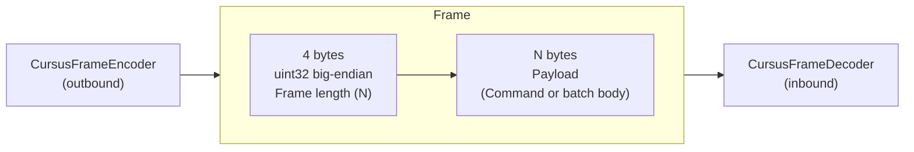
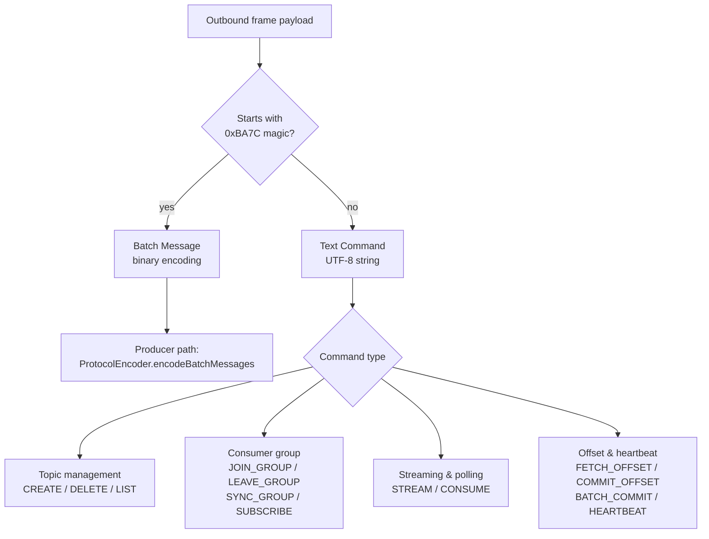

# Protocol

This document describes the wire protocol used between the Java client and the Cursus broker. The Java implementation mirrors the Go SDK's `protocol.go`.

## Transport

| Property | Value |
|---|---|
| Transport | TCP |
| Default port | `9000` |
| Frame delimiter | 4-byte big-endian length prefix |
| Maximum frame size | 64 MB (`64 * 1024 * 1024` bytes) |
| Encoding | UTF-8 for text commands; big-endian binary for batch messages |
| TLS | Optional; configured via `tlsCertPath` / `tlsKeyPath` |

## Frame Structure

Every message sent and received over the TCP connection is wrapped in a length-prefixed frame:

```
┌──────────────────────────────────────────────────────────────┐
│  4 bytes (uint32 big-endian)  │  N bytes (payload)           │
│  Frame length (N)             │  Command or batch body       │
└──────────────────────────────────────────────────────────────┘
```



The Netty pipeline handles framing transparently via `CursusFrameDecoder` (inbound) and `CursusFrameEncoder` (outbound). Application code never sees the length prefix.

## Commands

Text commands are UTF-8 strings. Fields are separated by a single space. The entire command string (without framing) is the payload.

| Command | Format | Description |
|---|---|---|
| `CREATE` | `CREATE topic=<topic> partitions=<N>` | Create a new topic with the given partition count |
| `DELETE` | `DELETE topic=<topic>` | Delete a topic and all its data |
| `LIST` | `LIST` or `LIST topic=<topic>` | List all topics or describe one topic |
| `CONSUME` | `CONSUME topic=<topic> partition=<P> offset=<N> group=<group> generation=<G> member=<member>` | Stateless partition-leader pull read starting at `offset` |
| `SUBSCRIBE` | `SUBSCRIBE topic=<topic> group=<group>` | Subscribe a consumer group to a topic |
| `JOIN_GROUP` | `JOIN_GROUP topic=<topic> group=<group> member=<member>` | Join a consumer group; broker registers the member |
| `LEAVE_GROUP` | `LEAVE_GROUP topic=<topic> group=<group> member=<member>` | Leave a consumer group; triggers partition rebalance |
| `STREAM` | `STREAM topic=<topic> partition=<P> group=<group> offset=<N> generation=<G> member=<member>` | Stateless partition-leader push stream; broker sends batches as they arrive |
| `COMMIT_OFFSET` | `COMMIT_OFFSET topic=<topic> partition=<P> group=<group> offset=<nextOffset> generation=<G> member=<member>` | Commit the next offset to read for one partition |
| `HEARTBEAT` | `HEARTBEAT topic=<topic> group=<group> member=<member> generation=<G>` | Keep-alive and generation fencing; coordinator errors trigger rejoin |
| `BATCH_COMMIT` | `BATCH_COMMIT topic=<topic> group=<group> member=<member> generation=<G> P<partition>:<nextOffset>,...` | Commit next offsets for multiple partitions in one round-trip |
| `SYNC_GROUP` | `SYNC_GROUP topic=<topic> group=<group> member=<member> generation=<G>` | Fetch partition assignment after joining a group |
| `FETCH_OFFSET` | `FETCH_OFFSET topic=<topic> partition=<P> group=<group>` | Fetch broker-committed next offset before consuming an assigned partition |
| `FIND_COORDINATOR` | `FIND_COORDINATOR group=<group>` | Resolve the current coordinator for a consumer group |
| `METADATA` | `METADATA topic=<topic>` | Fetch cluster metadata, including partition leaders |

### Command Routing




## Consumer Offset Contract

Consumer group offsets are broker-managed and durable. The committed value is the next offset to read, so after processing offset `N`, the SDK commits `N + 1`. After `JOIN_GROUP` and `SYNC_GROUP`, the SDK calls `FETCH_OFFSET` for each assigned partition before issuing `CONSUME` or `STREAM`.

`CONSUME` and `STREAM` are stateless partition-leader read paths. Ownership and generation fencing are enforced by coordinator commands such as `HEARTBEAT`, `COMMIT_OFFSET`, and `BATCH_COMMIT`. Batch commit entries must use the `P<partition>:<nextOffset>` form, for example:

```text
BATCH_COMMIT topic=orders group=workers member=m-1 generation=7 P0:11,P1:21
```

Lower offset commits are rejected by the broker as `ERROR: offset_regression ...`; the SDK treats that as a failed commit and does not rewind local committed state. Coordinator errors such as `GEN_MISMATCH`, `NOT_OWNER`, `member_not_found`, `group_not_found`, and `NOT_COORDINATOR` cause the consumer to re-resolve or rejoin.

For retention gaps, pull consumers handle `ERROR: OFFSET_OUT_OF_RANGE requested=<N> earliest=<N> latest=<N>`, and streaming consumers handle `STREAM_CONTROL type=CLOSE reason=offset_out_of_range ...`. Zero-length stream frames are keepalives.

## Batch Message Encoding

Producers send messages in binary batch format. The batch body (after the frame length prefix) has the following layout:

```
┌─────────────────────────────────────────────────────────────────────┐
│ HEADER                                                              │
│  uint16   magic = 0xBA7C                                            │
│  uint16   topicLen                                                  │
│  bytes    topic (UTF-8)                                             │
│  int32    partition                                                 │
│  uint8    acksLen                                                   │
│  bytes    acks (UTF-8, e.g. "1", "0", "-1")                        │
│  uint8    idempotent (0x00 = false, 0x01 = true)                   │
│  int64    seqStart (big-endian)                                     │
│  int64    seqEnd   (big-endian)                                     │
│  int32    messageCount (big-endian)                                 │
├─────────────────────────────────────────────────────────────────────┤
│ MESSAGES  (repeated messageCount times)                             │
│  int64    offset                                                    │
│  int64    seqNum                                                    │
│  uint16   producerIdLen                                             │
│  bytes    producerId (UTF-8)                                        │
│  uint16   keyLen                                                    │
│  bytes    key (UTF-8)                                               │
│  int64    epoch                                                     │
│  int32    payloadLen                                                │
│  bytes    payload (UTF-8)                                           │
│  uint16   eventTypeLen                                              │
│  bytes    eventType (UTF-8)                                         │
│  int32    schemaVersion                                             │
│  int64    aggregateVersion                                          │
│  uint16   metadataLen                                               │
│  bytes    metadata (UTF-8)                                          │
└─────────────────────────────────────────────────────────────────────┘
```

All integer fields are big-endian. Topic, producer id, key, event type, and metadata strings use a `uint16` (2-byte) length followed by UTF-8 bytes. The `acks` header uses a `uint8` length followed by UTF-8 bytes. Empty strings are encoded as length `0` with no following bytes.

The magic value `0xBA7C` (decimal 47740) identifies the frame as a Cursus batch. Any frame that does not begin with this magic value is treated as a text command.

## ACK Response Format

After processing a batch, the broker returns a JSON response as a UTF-8 string (still framed with the 4-byte length prefix):

```json
{
  "status": "OK",
  "last_offset": 1023,
  "producer_epoch": 1,
  "producer_id": "abc-def-123",
  "seq_start": 100,
  "seq_end": 199,
  "leader": "localhost:9000",
  "error": ""
}
```

| Field | Type | Description |
|---|---|---|
| `status` | `string` | `"OK"` on success, `"PARTIAL"` if only some messages were stored, `"ERROR"` on failure |
| `last_offset` | `number` | Highest offset assigned to the batch |
| `producer_epoch` | `number` | Current producer epoch tracked by the broker |
| `producer_id` | `string` | Producer identifier echoed from the batch header |
| `seq_start` | `number` | First sequence number in the acknowledged batch |
| `seq_end` | `number` | Last sequence number in the acknowledged batch |
| `leader` | `string` | Current leader address; used by the client to update its cached leader |
| `error` | `string` | Error message when `status` is not `"OK"`; empty string otherwise |

Special text responses (not JSON) the client also handles:

| Response text | Meaning |
|---|---|
| Contains `NOT_LEADER` | The broker is not the current partition leader; client clears cached leader and retries |
| Contains `REBALANCE_REQUIRED` | Consumer group rebalance is needed; consumer stops and rejoins |
| Contains `GEN_MISMATCH` / `NOT_OWNER` / `member_not_found` / `group_not_found` / `NOT_COORDINATOR` | Consumer group state is invalid or coordinator moved; consumer stops, re-resolves, or rejoins |
| Starts with `ERROR: offset_regression` | Commit failed because it would move the broker committed offset backward |
| Starts with `ERROR: OFFSET_OUT_OF_RANGE` | Requested consume offset is outside the retained range; `autoOffsetReset` decides earliest/latest/error |
| Starts with `ERROR:` | Hard broker error; the prefix is followed by an error description |

## Compression

When `compressionType` is not `"none"`, the entire encoded batch body is compressed before being wrapped in the length-prefixed frame:

```
Frame: [4-byte length] [compressed(batch body)]
```

The broker must understand the same compression algorithm. Built-in: `gzip`. Custom algorithms can be registered via `CompressionRegistry.getInstance().register(compressor)`.

The `CursusCompressor` interface:

```java
public interface CursusCompressor {
    String algorithmName();          // e.g. "gzip", "zstd"
    byte[] compress(byte[] data) throws Exception;
    byte[] decompress(byte[] data) throws Exception;
}
```
