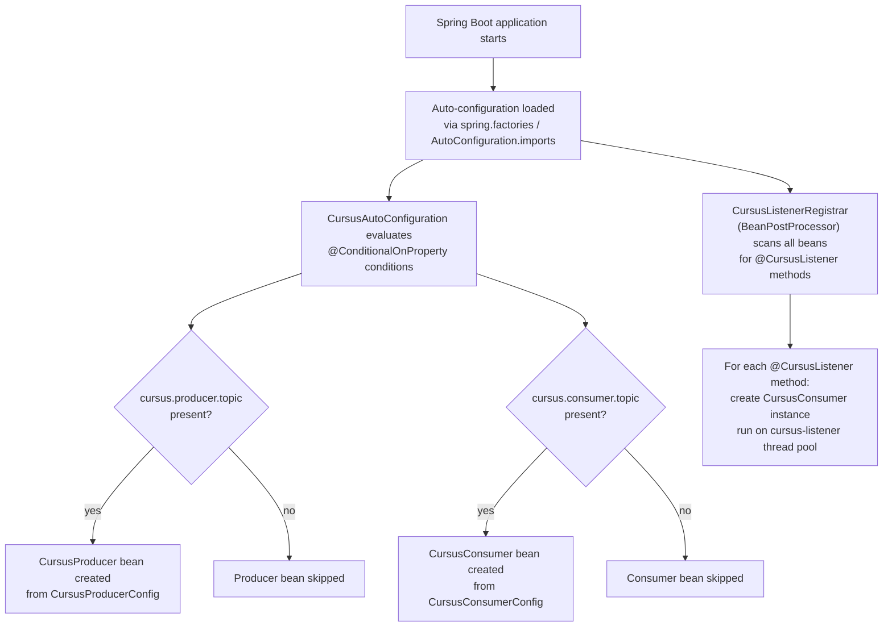
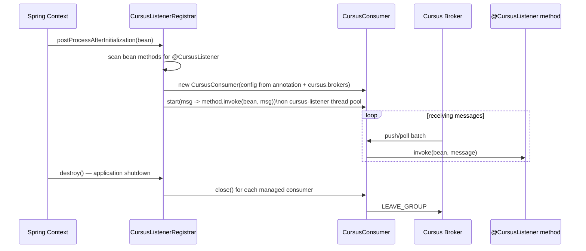

# Spring Boot Integration

The `cursus-spring-boot-starter` module provides zero-boilerplate auto-configuration for Spring Boot 3.x applications. It auto-creates `CursusProducer` and `CursusConsumer` beans from `application.yml` properties, and processes `@CursusListener` annotations on any Spring-managed bean.

## Setup

Add the starter dependency:

```groovy
// build.gradle
dependencies {
    implementation 'io.cursus:cursus-spring-boot-starter:0.1.0-SNAPSHOT'
    implementation 'org.springframework.boot:spring-boot-starter-web'
}
```

No `@EnableCursus` annotation is required. The auto-configuration is loaded automatically via the standard Spring Boot auto-configuration mechanism.

## Configuration

All properties live under the `cursus.*` prefix in `application.yml` (or `application.properties`). Spring Boot's relaxed binding maps kebab-case YAML keys to the camelCase fields in `CursusProperties`.

```yaml
cursus:
  brokers:
    - localhost:9000

  producer:
    topic: my-topic
    partitions: 4
    acks: one                  # none | one | all
    batch-size: 500
    linger-ms: 100
    compression-type: none     # none | gzip
    idempotent: false
    max-inflight-requests: 5
    flush-timeout-ms: 30000
    tls-cert-path:             # path to TLS cert (optional)
    tls-key-path:              # path to TLS key (optional)

  consumer:
    topic: my-topic
    group-id: my-group
    mode: streaming            # streaming | polling
    auto-commit-interval: 5s
    max-poll-records: 100
    session-timeout-ms: 30000
    heartbeat-interval-ms: 3000
    tls-cert-path:
    tls-key-path:
```

See [Configuration Reference](configuration-reference.md) for a complete list with types and defaults.

## Auto-Configuration Flow



## Auto-Configured Beans

### CursusProducer

A `CursusProducer` bean is created when `cursus.producer.topic` is set. The bean is conditional on the property being present (`@ConditionalOnProperty(prefix = "cursus.producer", name = "topic")`), so the producer is only instantiated when you configure a producer topic.

Inject it anywhere in your application:

```java
import io.cursus.client.producer.CursusProducer;
import org.springframework.web.bind.annotation.*;

@RestController
@RequestMapping("/messages")
public class MessageController {

    private final CursusProducer producer;

    public MessageController(CursusProducer producer) {
        this.producer = producer;
    }

    @PostMapping
    public String send(@RequestBody String payload,
                       @RequestParam(required = false) String key) {
        long seq = (key != null) ? producer.send(payload, key) : producer.send(payload);
        return "seq=" + seq + " acked=" + producer.getUniqueAckCount();
    }

    @PostMapping("/flush")
    public String flush() {
        producer.flush();
        return "Flushed. Total acked: " + producer.getUniqueAckCount();
    }
}
```

### CursusConsumer

A `CursusConsumer` bean is created when `cursus.consumer.topic` is set. This bean is available for injection, but most applications should use `@CursusListener` instead of starting the bean manually.

## @CursusListener Annotation

Annotate any `void` method on a Spring-managed bean (`@Service`, `@Component`, etc.) with `@CursusListener`. The method must accept a single `CursusMessage` parameter.

### @CursusListener Processing Flow



```java
import io.cursus.client.message.CursusMessage;
import io.cursus.spring.annotation.CursusListener;
import org.slf4j.Logger;
import org.slf4j.LoggerFactory;
import org.springframework.stereotype.Service;

@Service
public class OrderEventHandler {

    private static final Logger log = LoggerFactory.getLogger(OrderEventHandler.class);

    @CursusListener(topic = "orders", groupId = "order-processors")
    public void onOrder(CursusMessage message) {
        log.info("Received order: offset={} key={} payload={}",
                message.getOffset(), message.getKey(), message.getPayload());
    }
}
```

**Annotation attributes:**

| Attribute | Required | Default | Description |
|---|---|---|---|
| `topic` | yes | — | Cursus topic to subscribe to |
| `groupId` | yes | — | Consumer group identifier |
| `mode` | no | `"streaming"` | `"streaming"` or `"polling"` |

The broker address is read from `cursus.brokers` in the application environment. Each `@CursusListener` method gets its own `CursusConsumer` instance running on the shared `cursus-listener` thread pool (backed by virtual threads on Java 21+, or a fixed pool on Java 17–20).

Multiple `@CursusListener` methods in the same application are fully supported:

```java
@Service
public class MultiTopicHandler {

    @CursusListener(topic = "orders", groupId = "handlers")
    public void onOrder(CursusMessage msg) { /* ... */ }

    @CursusListener(topic = "payments", groupId = "handlers")
    public void onPayment(CursusMessage msg) { /* ... */ }

    @CursusListener(topic = "notifications", groupId = "notifiers", mode = "polling")
    public void onNotification(CursusMessage msg) { /* ... */ }
}
```

## Graceful Shutdown

`CursusListenerRegistrar` implements `DisposableBean`. When the Spring application context is closed (Ctrl+C, `SpringApplication.exit()`, or container shutdown), it calls `close()` on every `CursusConsumer` managed by `@CursusListener` registrations. Each `close()` sends `LEAVE_GROUP` to the broker before stopping.

The auto-configured `CursusProducer` bean does not implement `DisposableBean` directly; Spring will call `close()` automatically because it is `AutoCloseable` and was registered as a `@Bean`. This flushes any pending batches before the application exits.
